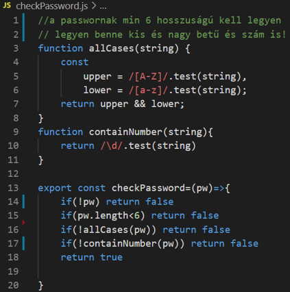
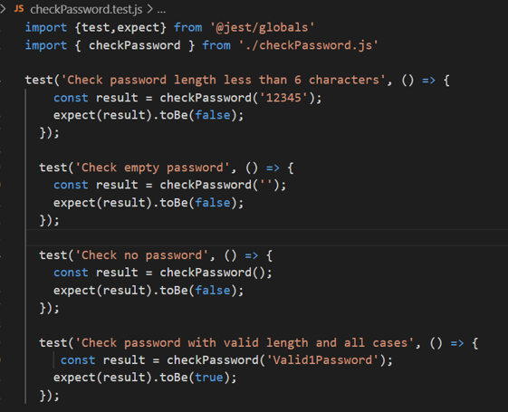
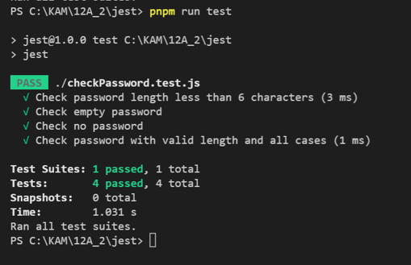

# How to unit test vanilla JavaScript with JEST with example

In project folder:
>pnpm init

>pnpm i --save-dev jest

>pnpm install --save-dev @babel/core @babel/preset-env

Create **jest.config.js** file :
>export default {
    testEnvironment: 'node',
    transform: {
      '^.+\\.js$': 'babel-jest',
    },
  };

Create **.babelrc** file:
>{
    "presets": [
      ["@babel/preset-env", { "targets": "current node" }]
    ]
}

Runing the tests:

>pnpm run test

Example:

  